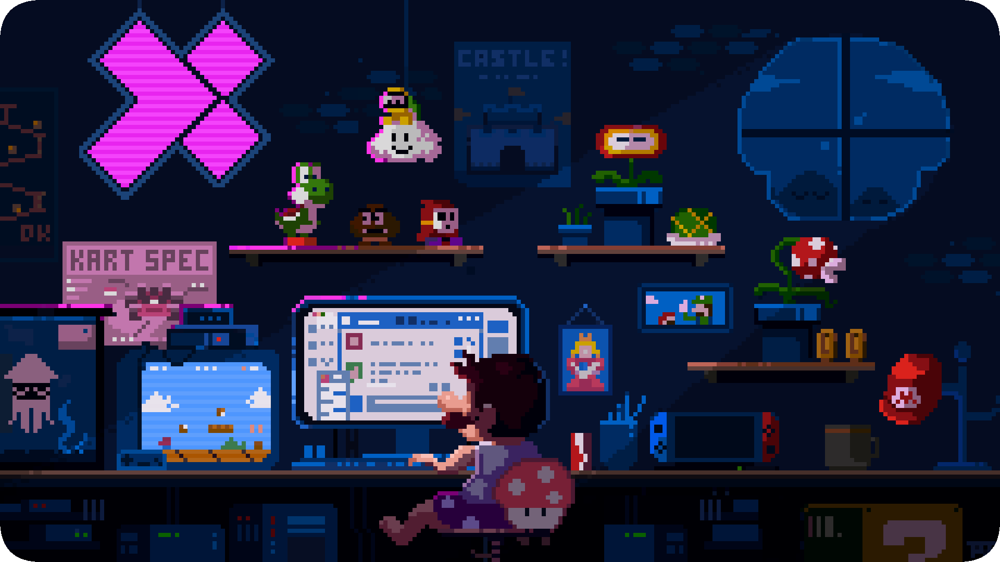

<h1>
  
  Hi, I'm Wassim!
  
</h1>

<ul>
  <li> Full-stack engineer</li>
  <li> Scalable architectures & automation</li>
  <li> Clean code, DevOps, Linux, Game dev</li>
  <li> Coffee & late-night debugging</li>
</ul>

  <picture>
    <source media="(prefers-color-scheme: dark)" srcset="https://raw.githubusercontent.com/platane/platane/output/github-contribution-grid-snake-dark.svg">
    
  </picture>

## 🌐 Socials:
 

# 💻 Tech Stack:
                                         
